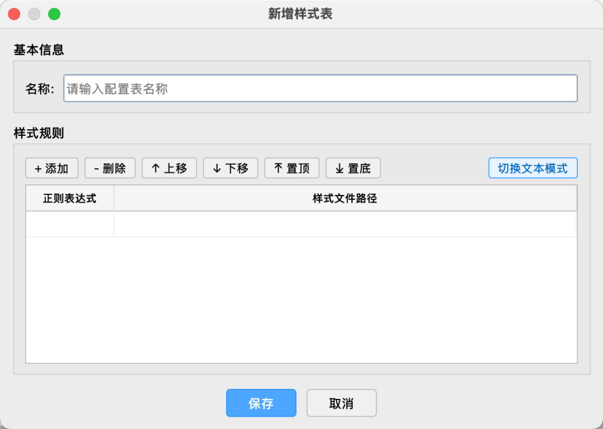

<p align="center">
  
</p>

<h1 align="center">🎨 AutoStyle</h1>

<p align="center">
  <strong>Style Management & Batch Apply Plugin for QGIS</strong><br>
  Regex-based layer name matching with automatic QML style application
</p>

<p align="center">
  <a href="README.md">📖 中文文档</a> •
  <a href="#features">✨ Features</a> •
  <a href="#installation">📦 Install</a> •
  <a href="#usage">🚀 Usage</a>
</p>

---

## ✨ Features

| Feature | Description |
|---------|-------------|
| 📋 **Style Config Management** | Create, edit, and delete style configurations |
| 🔍 **Regex Matching** | Match layer names using regular expressions |
| ⚡ **Batch Apply** | One-click apply QML style files to matched layers |
| 🌐 **i18n Support** | Auto-switch Chinese/English interface based on QGIS language settings |

## 📷 Screenshots

<table>
  <tr>
    <td align="center"><b>Main Interface</b></td>
    <td align="center"><b>Style Rules Configuration</b></td>
  </tr>
  <tr>
    <td></td>
    <td></td>
  </tr>
</table>

## 💻 Requirements

- 🟢 QGIS >= 3.22

## 📦 Installation

1. 📥 Download the plugin ZIP file
2. 🔧 Open QGIS, go to `Plugins` → `Manage and Install Plugins` → `Install from ZIP`
3. ✅ Select the downloaded ZIP file and install

## 🚀 Usage

### 1️⃣ Open Plugin

Click the AutoStyle icon on the toolbar, or open via menu `Plugins` → `AutoStyle` → `AutoStyle`.

### 2️⃣ Create Style Config

Click the `+` button, enter config name and style rules.

### 3️⃣ Config Format

One rule per line, format:

```
regex_pattern | qml_style_file_path
```

**Example:**

```
^road.*     | /path/to/road.qml
^building   | /path/to/building.qml
.*river.*   | /path/to/river.qml
```

### 4️⃣ Apply Styles

Select a config and click `Apply` button, the plugin will:

1. 🔄 Traverse all layers in the current project
2. 🎯 Match layer names using regex patterns
3. 🎨 Apply corresponding QML styles to matched layers

## 📁 Project Structure

```
AutoStyle/
├── 📄 __init__.py          # Plugin entry point
├── 📄 auto_style.py        # Main plugin class
├── 📄 metadata.txt         # Plugin metadata
├── 🖼️ icon.svg             # Plugin icon
├── 📂 core/
│   ├── 📄 __init__.py
│   ├── 🌐 i18n.py          # Internationalization module
│   ├── 📋 style_manager.py # Style config CRUD operations
│   └── ⚙️ layer_processor.py # Layer traversal and style application
├── 📂 ui/
│   ├── 📄 panel_widget.py  # Main dialog UI
│   └── 📄 edit_dialog.py   # Edit dialog UI
└── 📂 styles/              # Style configs storage (JSON)
```

## 🛠️ Development

### Package

```bash
./scripts/package.sh
```

📦 The packaged ZIP file will be generated in the `dist/` directory.

---

<p align="center">
  Made with ❤️ for QGIS users
</p>
